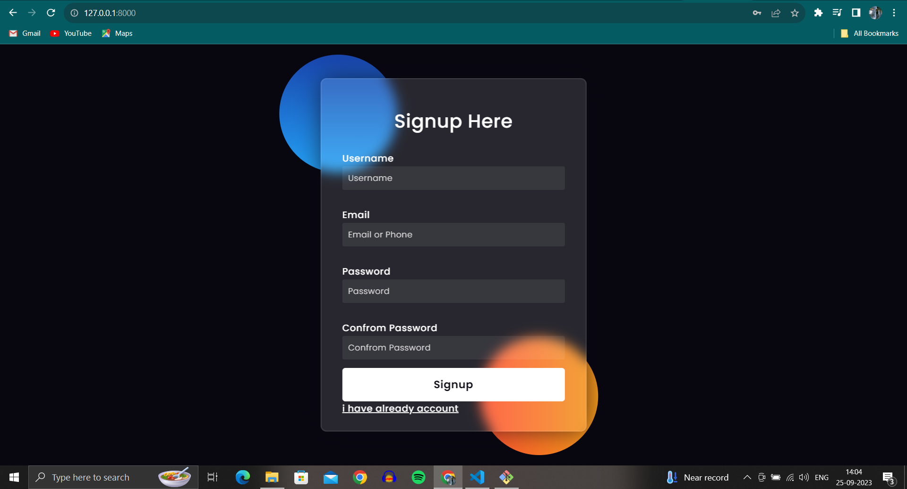

# Django User Authentication With File Upload System

The Project is to create a Django web application that includes a user authentication system and a file upload system. Users should be able to register, log in, and log out. Authenticated users should have the ability to upload files to the system.

The combination of user authentication and file upload functionality will allow your Django application to securely manage user accounts and handle uploaded files, making it suitable for a wide range of web applications, such as document management systems, image galleries, or collaborative platforms.

## Step By Step Process of User-Login Authentication :

### 1. User Login Page ---
### Screenshot of Login Page :

If The User is Not Created any Account then Click on Create an Account
### 2. Sign UP Page ---
### Screenshot of Sign Up Page :

### 3. Before File Upload Page ---
### Screenshot of Before Uploading the File in File Upload Page :

### 4. After File Upload Page ---
### Screenshot of Before Uploading the File in File Upload Page :

